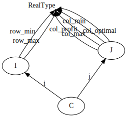
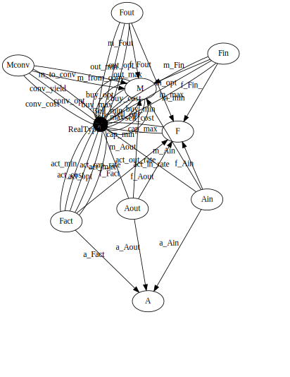

# Databases and optimization: a match made in heaven
Sean L. Wu
2023-12-03

There’s a great paper [“Database structures for mathematical programming
models”](https://www.sciencedirect.com/science/article/abs/pii/S0167923697000079)
that describes how databases and optimziation models can interact to
make complex modeling tasks easier, using as a jumping off point a
project regarding steel production. Let’s figure it out.

First we’ll load the packages we’ll need.

``` julia
using Catlab
```

## LP problem

The basic setup considering LPs of the form:

$$
\begin{align*}
\text{max      } & \sum_{j=1}^{n} c_{j}x_{j} \\
\text{subject to      } & l_{i}^{\text{row}} \leq \sum_{j=1}^{n} a_{ij}x_{j} \leq u_{i}^{\text{row}}, i=1,\dots,m \\
& l_{j}^{\text{col}} \leq x_{j} \leq u_{j}^{\text{col}}, j=1,\dots,n
\end{align*}
$$

It has a “relational” interpretation by defining the following sets:

- $\mathcal{I}=\{1,\dots,m\}$: set of constraints
- $\mathcal{J}=\{1,\dots,n\}$: set of decision variables

For each $i\in\mathcal{I}$ we have the data:

- $l_{i}^{\text{row}}$: lower limit on constraint $i$
- $u_{i}^{\text{row}}$: upper limit on constraint $i$

For each $j\in\mathcal{J}$ we have the data:

- $x_{j}$: actual value of the decision variable (post-optimization; not
  required to *set up* the LP problem)
- $c_{j}$: profit (if positive) or cost (if negative) per unit of the
  variable
- $l_{j}^{\text{col}}$: lower limit on variable $j$
- $u_{j}^{\text{col}}$: upper limit on variable $j$

We also define a set of constraint-variable pairs:

- $\mathcal{C}\subseteq\mathcal{I}\times\mathcal{J}$ such that
  $(i,j)\in\mathcal{C}$ means variable $j$ is used in constraint $i$
- $a_{ij}$ is the coefficient of variable $j$ in constraint $i$

Using the relational point of view, we can rewrite the LP as:

$$
\begin{align*}
\text{max      } & \sum_{j\in\mathcal{J}} c_{j}x_{j} \\
\text{subject to      } & l_{i}^{\text{row}} \leq \sum_{(i,j)\in\mathcal{C}} a_{ij}x_{j} \leq u_{i}^{\text{row}}, \forall i\in\mathcal{I} \\
& l_{j}^{\text{col}} \leq x_{j} \leq u_{j}^{\text{col}}, \forall j\in\mathcal{J}
\end{align*}
$$

If the middle sum is slightly ambigious, it means there is an outer loop
over $i\in\mathcal{I}$ and the inner summation is over $j\in\mathcal{J}$
associated to that $i$.

### Relational database for LP model

The paper describes how to use the relational interpretation to build a
database representation of the general LP problem. Let’s just use Catlab
to visualize the schema they propose. We use the names of the previous
section, in the paper our `I` would be their `CONSTRAINTS`, `J` their
`VARIABLES` and `C` their `COEFFICIENTS`.

``` julia
@present GeneralSch(FreeSchema) begin
    (I,J,C)::Ob
    i::Hom(C,I)
    j::Hom(C,J)
    RealType::AttrType
    row_min::Attr(I,RealType)
    row_max::Attr(I,RealType)
    col_profit::Attr(J,RealType)
    col_min::Attr(J,RealType)
    col_optimal::Attr(J,RealType)
    col_max::Attr(J,RealType)
end

Catlab.to_graphviz(GeneralSch,graph_attrs=Dict(:dpi=>"72",:size=>"4",:ratio=>"expand"))
```



It’s immediately obvious why $\mathcal{C}$ is a relation in the database
sense.

## Basic process model

The basic idea of the models is: raw materials enter, various
transformations to intermediate materials occur, and finished materials
leave. Profit is total revenue from finished products, minus costs of
raw materials and transformations.

Model has some stuff:

- Materials: all the physical stuff, including raw, intermediate, and
  finished materials. Each have data on:
  - cost per unit for buying, min/max quantities that can be bought
  - revenue per unit for selling, and min/quantities that can be sold
  - raw materials can only be bought, finished can only be sold,
    intermediates often neither. We can also have list of allowed
    conversions to other materials, with given yield and cost per unit
    converted.
- Facilities: places at which transformations occur. They may have data
  on:
  - min/max on overall capacity
  - min/max on total use of each input
  - min/max on total use of each output
- Activities: housed in facilities. Activities use and produce materials
  in certain proportions. Each activity at a facilities has the
  following data:
  - Amount of each input for unit of activity
  - Amount of each output for unit of activity
  - Cost per unit of activity
  - min/max on units of activity
  - units of activity that can be accomodated by one unit of the owning
    facility’s overall capacity

## First “algebraic” formulation

Fundamental sets:

- $\mathcal{M}$: Materials
- $\mathcal{F}$: Facilities
- $\mathcal{A}$: Activities

Note that the paper does not explicitly define $\mathcal{A}$. The author
does this because there are no model components directly indexed over
activities. However, we need to include them because they are deeply
important for the relational structure of the model, and there is no
reason the model would not be extended to incldue things directly
indexed over activities.

There are also relations which are used to index data over tuples of
elements of some of the fundamental sets:

- $\mathcal{M}^{conv}\subseteq\mathcal{M}\times\mathcal{M}$: conversions
  between materials
- $\mathcal{F}^{in}\subseteq\mathcal{F}\times\mathcal{M}$: material
  inputs to facilities
- $\mathcal{F}^{out}\subseteq\mathcal{F}\times\mathcal{M}$: material
  outputs to facilities
- $\mathcal{F}^{act}\subseteq\mathcal{F}\times\mathcal{A}$: activities
  at each facility
- $\mathcal{A}^{in}\subseteq\mathcal{F}\times\mathcal{M}\times\mathcal{A}$:
  inputs for each activity at each facility
- $\mathcal{A}^{out}\subseteq\mathcal{F}\times\mathcal{M}\times\mathcal{A}$:
  outputs from each activity at each facility

The last 2 relations can be written out a bit more pedantically, for
example:

$$
\mathcal{A}^{in}\subseteq\{ (i,j,k):(i,j)\in\mathcal{F}^{in} \text{ and } (i,k)\in\mathcal{F}^{act} \}
$$

Then it’s clear that they can also be said to be inner joins along $i$,
the set of facilities.

Note that due to the symmetry of the relations, sentences like
“activities at each facility” could be rearranged without loss of
generality to something like “facilities having each activity”. We just
phrased something in what felt more natural given the “story” behind the
model.

## Relational formulation

We kept the names of the attribute columns the same as the paper, but
changed the name of some projections to always end in the name of the
domain object, to be more clear what’s a foreign key and what’s a data
attribute.

``` julia
@present ProductionSch(FreeSchema) begin
    (M,F,A,Mconv,Fin,Fout,Fact,Ain,Aout)::Ob
    # projections from M_conv
    m_from_conv::Hom(Mconv,M)
    m_to_conv::Hom(Mconv,M)
    # projections from F_in
    f_Fin_::Hom(Fin,F)
    m_Fin::Hom(Fin,M)
    # projections from F_out
    f_Fout::Hom(Fout,F)
    m_Fout::Hom(Fout,M)
    # projections from F_act
    f_Fact::Hom(Fact,F)
    a_Fact::Hom(Fact,A)
    # projections from A_in
    f_Ain::Hom(Ain,F)
    m_Ain::Hom(Ain,M)
    a_Ain::Hom(Ain,A)
    # projections from A_out
    f_Aout::Hom(Aout,F)
    m_Aout::Hom(Aout,M)
    a_Aout::Hom(Aout,A)

    # data attributes
    RealType::AttrType
    buy_min::Attr(M,RealType)
    buy_opt::Attr(M,RealType)
    buy_max::Attr(M,RealType)
    buy_cost::Attr(M,RealType)
    sell_min::Attr(M,RealType)
    sell_opt::Attr(M,RealType)
    sell_max::Attr(M,RealType)
    sell_cost::Attr(M,RealType)

    cap_min::Attr(F,RealType)
    cap_max::Attr(F,RealType)

    conv_yield::Attr(Mconv,RealType)
    conv_cost::Attr(Mconv,RealType)
    conv_opt::Attr(Mconv,RealType)

    in_min::Attr(Fin,RealType)
    in_opt::Attr(Fin,RealType)
    in_max::Attr(Fin,RealType)

    out_min::Attr(Fout,RealType)
    out_opt::Attr(Fout,RealType)
    out_max::Attr(Fout,RealType)

    act_min::Attr(Fact,RealType)
    act_opt::Attr(Fact,RealType)
    act_max::Attr(Fact,RealType)
    act_cost::Attr(Fact,RealType)
    act_cap_rate::Attr(Fact,RealType)

    act_in_rate::Attr(Ain,RealType)

    act_out_rate::Attr(Aout,RealType)
end

Catlab.to_graphviz(ProductionSch,graph_attrs=Dict(:dpi=>"72",:size=>"4",:ratio=>"expand"))
```


